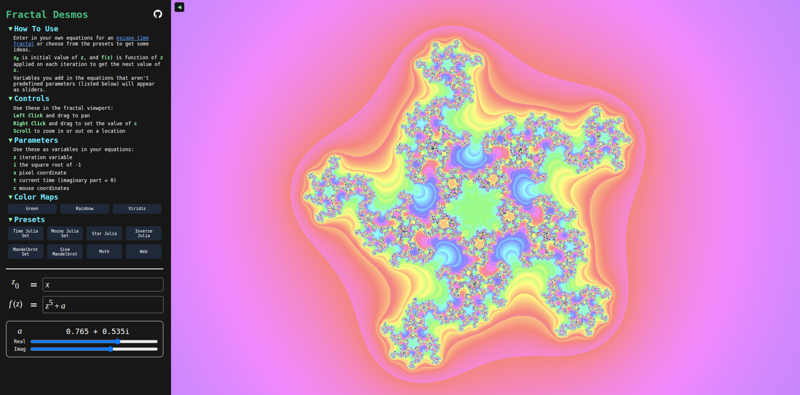

# Fractal Desmos

A graphing calculator for escape time fractals built with Typescript and WebGPU. Check it out [here](https://tvumcc.github.io/fractal-desmos/).



## WebGPU Support

As of August 2025, WebGPU is relatively new, so browsers are still in the process of adopting it. Generally, using Chrome or any Chromium-based browser should allow the project to work (on Linux you may have to enable a flag). Firefox has WebGPU support on Windows by default as of version 141. See [here](https://github.com/gpuweb/gpuweb/wiki/Implementation-Status) for more details.

## Supported Complex Functions and Operations

- Addition, Subtraction, Multiplication (including Implicit), Division, and Exponentiation
- sin, cos, tan
- ln, log

## How it works

When the user types into the math formula entry, the program parses the resulting Latex expression into an [Abstract Syntax Tree](https://en.wikipedia.org/wiki/Abstract_syntax_tree). This AST is used to reinterpret the Latex expression into a string of valid [WGSL](https://en.wikipedia.org/wiki/WebGPU_Shading_Language) that makes use of custom written, complex definitions of functions like multiplication, sin, and ln.  This is then inserted into the shader code at the appropiate spot in the escape time iteration loop, and the shader is recompiled.

## Building

Follow these commands to build the project:

```bash
git clone https://github.com/tvumcc/fractal-desmos.git
cd fractal-desmos
npm install

# For Development
npm run dev

# For Release
npm run build
```

## Attribution

- [Mathquill](https://github.com/mathquill/mathquill) for the math formula input component
- Robert Nystrom's book [Crafting Interpreters](https://craftinginterpreters.com/)

Disclaimer: This project is in no way affiliated with Desmos and their suite of math tools.